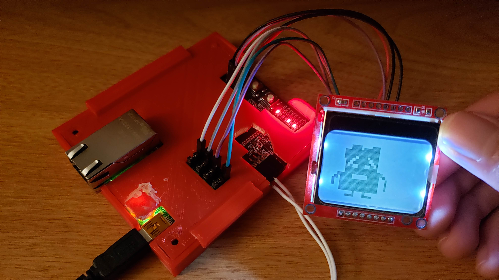

# Nokia5110_first

This project focused on creating a custom VHDL core to drive a Nokia5110 LCD.

Nokia_Driver_Container.vhd is a simple container to direct pins and signals using VHDL as oppposed to dragging wires in the GUI. There was a problem in hardware in which the reset signal to the LCD was rising late. This meant the SPI signal was being sent before the device left reset somehow. The timer component keeps the Nokia5110 driver from beginning its transfer for an additional 0.25ms after reset is set high. I view the timer as a temporary work around until I can troubleshoot more. My first thought is the VDD supply ramp time of 100ms is not being accounted for in any of the reset sources in the fabric. I'll have to see.

Nokia5110_Memory.vhd is created as a standalone file to reduce the size of the Driver file. It has been prepopulated with Ignignokt.

Nokia5110_Driver.vhd is the meat. It mimics an SPI master but is solely intended to drive the Nokia5110 LCD. Only features and connections present in the Nokia5110 LCD have been included.

