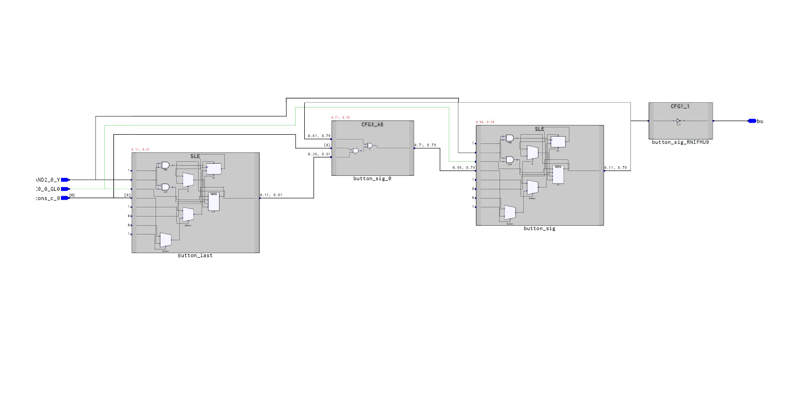

# Base Design

The base design I will be analyzing is very simple. It takes input from a button the development board, checks if the button has been pressed (rising edge), and if so, toggles a flipflop. The flipflop is connected out to an LED. This design has 2 single bit registers. The first stores the previous state of the button updated every clock cycle. This will then be tested to see if the previous state the button was low and the current state is high. If these conditions are met, the second flipflop will be set as the negated value of itself.

