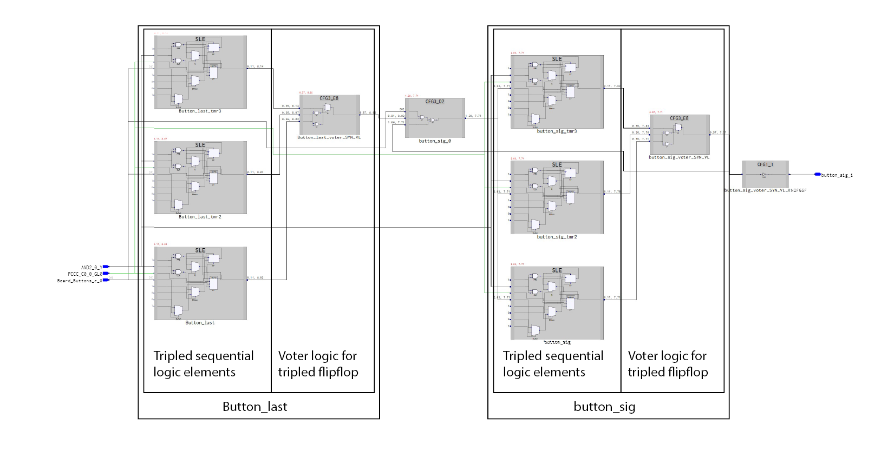

# Triple Modular Redundency

A problem that remains even when using hardware that is physically more resistant to single event upsets is that it is still not immune to SEU. A solution that can be implemented on a single bit register basis is triple modular redundency in which the same bit is stored in 3 different flip flops. These flipflops are then compared and "vote" such that the output is agreed upon by at least 2 of the flipflops.

The truth table for a TMR register:

|A|B|C|Q|
|:---:|:---:|:---:|:---:|
|0|0|X|0|
|0|1|0|C|
|1|0|0|C|
|1|1|X|1|

Accomplishing this with Microsemi's Libero SoC design software and Synplify Pro can be done with Synplify attributes. Synplify attributes can be specified in the constraints file or directly in the vhdl defined architecture.

The following is the latter method.

```vhdl
library synplify;

entity TMR_design is 
port(
    port1 : std_logic
);
end TMR_design;
architecture arch_TMR_design of TMR_design is
    attribute syn_radhardlevel : string;
    attribute syn_radhardlevel of architecture_Triple_Mod_Redun_test: architecture is "tmr";
begin
    -- vhdl logic
end arch_TMR_design;
```

